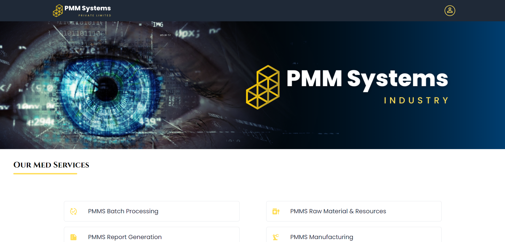

<h2 align="center">
 Pharma Medical Management System - v1.0<br/>
  <a href="https://pharma-medical-management-system.vercel.app/" target="_blank">Live App</a>

</h2>

## Status: Development

Pharma Medical Management System is a MERN Application which developed with the features of Pharma Medical Data Tracking, Processing and Report Generation Management System.
*Note: This is frontend repository.




## Tools & Technologies

- ReactJS
- NodeJS
- ExpressJS
- MongoDB
- TailwindCSS
- Material UI
- Postman
- Git & GitHub
- Vercel


## Prerequisites

Before running this project, make sure you have the following installed:

- Node.js: [Download and Install Node.js](https://nodejs.org/en/download "Node.js Download")
- Git: [Download and Install git globally](https://git-scm.com/ "git Download")

## Installation

Follow these steps to set up the application:

1. Open Powershell/Terminal and Clone the repository to your local machine:

   ```bash
   git clone https://github.com/Harish1611/Pharma-Medical-Management-System.git
   ```

2. Navigate to the project directory:

   ```bash
   cd Pharma-Medical-Management-System
   ```

3. Install the required dependencies:

   ```bash
   npm install or npm i
   ```


## Get Started

To run the Pharma Medical Management System Frontend App, perform the following actions:

1. Start React Project Server :

   ```bash
   npm start
   ```
2. Runs the app in the development mode. Open http://localhost:3000 to view it in the browser. The page will reload if you make edits.


## Pharma Medical Management System - Backend <a href="https://github.com/Harish1611/pharma-medical-management-system-backend">  </a>

